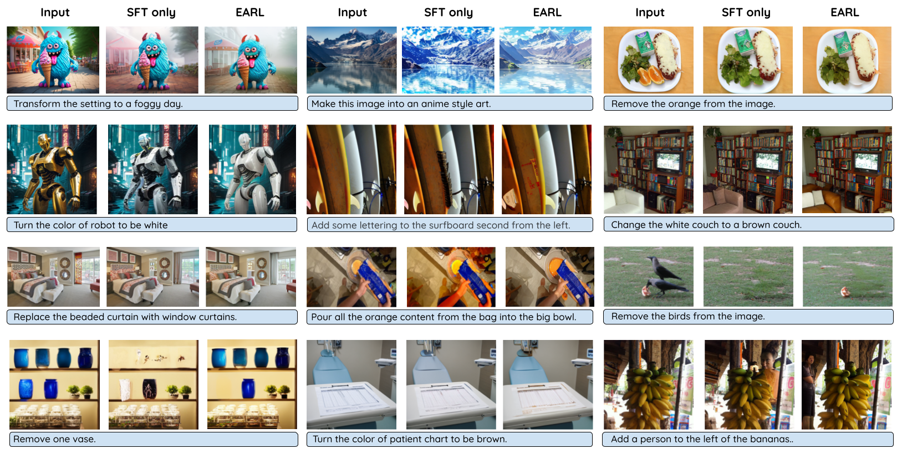

# EARL: The Promise of RL for Autoregressive Image Editing

[](https://www.arxiv.org/abs/2508.01119) 

🎉 **Exciting News**: EARL: The Promise of RL for Autoregressive Image Editing is accepted at NeurIPS 2025! 🎉

 
Official code for the paper *The Promise of RL for Autoregressive Image Editing (EARL)*.



This README provides an overview of how to prepare and tokenize data for EARL image editing using either a Hugging Face dataset or local data. It also covers SFT, RL training and evaluation steps.

## Table of Contents

- [Prerequisites - Installation](#prerequisites---installation)
- [Model](#model)
  - [Try the model quickly: vLLM inference](#try-the-model-quickly-vllm-inference)
  - [Trained Models on HF 🤗](#trained-models-on-hf-)
- [Dataset](#dataset)
  - [Dataset on HF 🤗](#dataset-on-hf-)
  - [Tokenization](#tokenization)
- [SFT Training](#sft-training)
- [RL Training](#rl-training)
- [Evaluation](#evaluation)
- [Citation](#citation)

## Prerequisites - Installation

```bash
git clone https://github.com/saba96/EARL.git
cd EARL
python -m venv /path/to/envs/EARL
. /path/to/envs/EARL/bin/activate
pip install torch==2.6.0 torchvision==0.21.0 --index-url https://download.pytorch.org/whl/cu124
pip install vllm==0.8.4
pip install flash-attn==2.7.4.post1 --no-build-isolation
pip install -r requirements.txt
export PYTHONPATH=$(pwd)
```

## Model

### Try the model quickly: vLLM inference
1. Patch vLLM to support Emu3
```
vim /path/to/venv/lib/python3.10/site-packages/vllm/model_executor/models/registry.py
```

Add the following line to the file line 166
```python
_MULTIMODAL_MODELS = {    
    # add this line
    "Emu3ForCausalLM": ("llama", "LlamaForCausalLM"), 
    # end of adding
    "AriaForConditionalGeneration": ("aria", "AriaForConditionalGeneration"), # already exists
    ...
}
```

2. Run inference on Omniedit


EARL on Hugging Face 🤗: [mair-lab/earl-sft-simple.rl-simple-n-complex-scaled](https://huggingface.co/mair-lab/earl-sft-simple.rl-simple-n-complex-scaled)
```bash
. ./scripts/batch_eval.sh
```

Notes:
- vLLM support infinite batch size, so technically you can pass entire validation set at once.

### Trained Models on HF 🤗
Trained models are available on Hugging Face 🤗: [mair-lab/earl collection](https://huggingface.co/collections/mair-lab/earl-68463d983c20ede59af1345a)

## Dataset
### Dataset on HF 🤗
For convenience, we provide pre-tokenized training data on Hugging Face 🤗: [mair-lab/earl-datasets](https://huggingface.co/datasets/mair-lab/earl-datasets)

### Tokenization
 We have tokenization code compatible with both Hugging Face datasets and local files. Follow the steps below to tokenize your data.

To tokenize your data, use the following command. Make sure the images are in PIL format, if not you can slightly modify the code to read the image in the provided format. You can specify which key in your dataset corresponds to each required component (original image, edited image, and text instruction). You **need** to provide list of which keys are part of CoT. **Please see ./scripts/tokenize.sh**:

```bash
python ./emu3/train_image_editing/prepare_data_from_hugging.py --dataset-name "$data_name" --output-path "$output_dir" --original-image-key "$original_image_key" --edit-instruction "$edit_instruction" --CoT-keys "${CoT_keys[@]}" --edited-image "$edited_image" --image-area $image_area --random-seed 42
```

Parameters:
- `--dataset-name`: Path to your dataset, which can be either:
  - A Hugging Face dataset name (e.g., "username/dataset-name")
  - A local path to parquet files containing your dataset
- `--output-path`: Directory where the tokenized data will be saved
- `--original-image-key`: The key/column name in your dataset that contains the original images
- `--edit-instruction`: The key/column name containing the text instructions for editing
- `--CoT-keys`: Array of keys/column names that are part of the Chain of Thought (CoT) process
- `--edited-image`: The key/column name containing the edited/result images
- `--image-area`: The target area for the images (in pixels)
- `--random-seed`: Random seed for reproducibility
- `--source`: Source HF or local.
  - Default: `HF`

For multi-GPU tokenization, use the provided script:
```bash
. ./scripts/tokenize.sh
```

## SFT Training

Trained models are available on Hugging Face 🤗: [mair-lab/earl collection](https://huggingface.co/collections/mair-lab/earl-68463d983c20ede59af1345a)

For training, choose between DeepSpeed Stage Zero 3 or DeepSpeed Stage Zero 3 offload based on your available resources. Use:

```bash
. ./scripts/ie_sft.sh
. ./scripts/ie_sft_offload.sh
```

Ensure that the `DATAPATH` and `VALPATH` variables point to your **tokenized data** list from the previous step, and adjust `EXP_NAME` and `--output_dir`.

**Note**: Adjust ``--cot_keys`` to mention which keys of CoT is intended to use for training if you want to train with reasoning. See example below.

```bash
--cot_keys 'reasoning_verbose'
```

The `--coefficients` argument is used to control the coefficient of sampling for each dataset.

If provided, each dataset is sampled based on its coefficient.
If not provided, the script automatically oversamples smaller datasets to match the size of the largest dataset.
**Important Note:** If you want automatic upsampling, remove the --coefficients argument when running the script.

## RL Training

The RL training is designed to be user-friendly with clear configuration options and automatic checkpointing. Check out [`rl/README.md`](./rl/README.md) for detailed instructions!

The current configs in [`rl/configs/`](./rl/configs/) are sample configurations. The final configurations used in the paper will be released soon.


## Evaluation

See README file inside `baselines/` directory.


## Citation

If you use this code or paper in your research, please cite our work:

```bibtex
@inproceedings{earl2025,
  title={The Promise of RL for Autoregressive Image Editing}, 
  author={Saba Ahmadi and Rabiul Awal and Ankur Sikarwar and Amirhossein Kazemnejad and Ge Ya Luo and Juan A. Rodriguez and Sai Rajeswar and Siva Reddy and Christopher Pal and Benno Krojer and Aishwarya Agrawal},
  booktitle={Advances in Neural Information Processing Systems (NeurIPS)},
  year={2025}
}
```
